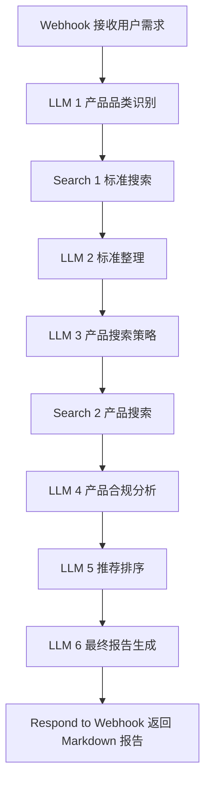

# Product Standard Compliance Recommendation Agent

产品标准合规推荐助手是一个面向“商品选购、采购辅助、产品合规初筛”的 AI Workflow 项目。它不是简单推荐商品，而是先查询产品相关生产执行标准、国家标准、行业标准或认证要求，再根据公开证据筛选商品，最后生成结构化推荐报告。

## 项目简介

用户输入一个自然语言产品需求，例如“我想买一个儿童保温杯，预算 100 元以内，要求安全、符合国家标准，并给我购买链接”。工作流会自动识别产品品类，检索相关标准，分析商品页面是否公开标注执行标准或认证信息，并输出推荐排序、证据链接和风险提醒。

## 用户痛点

- 普通用户很难判断商品是否真的符合国家标准。
- 电商页面营销信息多，执行标准、检测报告和认证信息分散。
- 采购或选品场景需要快速做合规初筛，但人工查标准成本高。
- 大模型容易把“可能符合”说成“确定符合”，需要明确证据约束。

## 解决方案

本项目使用 n8n 串联 Webhook、LLM、搜索 API 和结构化报告生成节点。核心策略是“先查标准，再找商品，再看证据，最后推荐”，并在 Prompt 中强约束不编造标准编号、不编造商品链接、不把弱证据写成确定结论。

## 工作流流程图



## 核心功能

- 用户需求结构化：提取产品名称、预算、地区、场景和特殊要求。
- 标准检索：优先检索国家标准全文公开系统、全国标准信息公共服务平台、监管部门和行业协会。
- 证据链判断：区分官方标准来源、品牌官网、电商详情页、检测报告和第三方线索。
- 合规风险提醒：对缺少公开证据的商品明确标注“暂无公开证据证明”。
- 商品推荐排序：按标准匹配度、信息可信度、价格合理性、品牌可信度和用户需求匹配度评分。
- 结构化报告：输出标准表格、推荐表格、最推荐产品、性价比产品、来源链接和免责声明。

## 技术栈

- n8n：工作流编排
- OpenAI Chat Completions API：品类识别、标准整理、证据分析、排序和报告生成
- SerpAPI / Tavily / Bing Search API / Firecrawl：标准和商品搜索
- Webhook：对外接收产品需求
- Markdown：最终报告格式

## n8n 节点说明

| 节点 | 类型 | 作用 |
|---|---|---|
| Webhook | n8n Webhook | 接收用户产品需求 |
| LLM 1 - Product Category Identification | HTTP Request | 识别产品品类和标准检索关键词 |
| Search 1 - Standard Search | HTTP Request | 检索相关标准、认证和检测信息 |
| LLM 2 - Standard Extraction | HTTP Request | 提取标准编号、名称、适用范围和证据链接 |
| LLM 3 - Product Search Strategy | HTTP Request | 生成商品搜索关键词组合 |
| Search 2 - Product Search | HTTP Request | 检索商品、品牌官网、电商详情页和检测报告 |
| LLM 4 - Compliance Analysis | HTTP Request | 判断商品是否公开标注标准或认证信息 |
| LLM 5 - Product Ranking | HTTP Request | 按评分规则排序推荐 |
| LLM 6 - Final Report | HTTP Request | 生成面向用户的 Markdown 报告 |
| Respond to Webhook | Respond to Webhook | 返回最终报告 |

## 输入字段

| 字段 | 类型 | 说明 |
|---|---|---|
| product_name | string | 产品名称，例如“儿童保温杯” |
| use_case | string | 使用场景，例如“小学生日常上学使用” |
| budget | string | 预算，例如“100 元以内” |
| region | string | 购买地区，例如“中国大陆” |
| extra_requirements | string | 特殊要求，例如“安全、防漏、材质合规、有执行标准说明” |

## 输出结果

最终输出为 Markdown 报告，包含：

1. 产品类别判断
2. 相关生产执行标准整理
3. 选品判断标准
4. 推荐产品列表
5. 最终推荐结论
6. 风险提醒
7. 信息来源链接
8. 免责声明

## 示例输入

```json
{
  "product_name": "儿童保温杯",
  "use_case": "小学生日常上学使用",
  "budget": "100元以内",
  "region": "中国大陆",
  "extra_requirements": "安全、防漏、材质合规、有执行标准说明"
}
```

## 示例输出

完整示例见 [examples/sample_output.md](examples/sample_output.md)。示例商品链接使用占位符，真实运行时必须由搜索节点返回真实链接。

## 如何导入 n8n

1. 打开 n8n。
2. 新建 workflow。
3. 右上角菜单选择 `Import from File`。
4. 选择 `n8n/product_standard_compliance_workflow.json`。
5. 检查 Webhook、OpenAI HTTP Request、搜索 HTTP Request 节点。
6. 配置环境变量 `OPENAI_API_KEY` 和 `SERPAPI_API_KEY`，或在节点中替换为自己的凭据。
7. 点击 `Execute workflow` 测试。
8. 测试成功后保存并激活 workflow。

## 如何测试 Webhook

导入工作流后，可使用：

```bash
curl -X POST "http://localhost:5678/webhook/product-compliance-recommend" \
  -H "Content-Type: application/json" \
  -d @n8n/test_payload.json
```

## 项目亮点

- 将“标准查询 + 合规筛选 + 商品推荐”串成可执行工作流。
- Prompt 明确区分事实、证据、推断和风险。
- 输出适合普通用户阅读，也能展示产品经理的流程设计能力。
- 可接入真实搜索 API，也可用模拟数据做 Demo。
- 适合作为 AI 产品经理、Agent 设计、工作流自动化方向作品集项目。

## 局限性

- 搜索结果质量依赖外部搜索 API。
- 电商页面可能动态渲染，普通搜索 API 未必能抓到完整详情。
- 标准是否适用需要结合产品材质、结构、用途和监管口径判断。
- 本项目只做公开信息初筛，不替代检测机构或监管结论。

## 未来优化方向

- 接入国家标准平台、品牌官网和电商详情页的定向爬取。
- 增加 OCR，识别商品详情图中的执行标准和检测报告。
- 增加标准知识库缓存，减少重复检索成本。
- 增加人工审核节点，用于采购或企业合规场景。
- 输出 PDF 报告和 Notion/飞书文档。

## 作品集展示能力

这个项目体现了 AI 产品经理在需求拆解、工作流设计、Prompt 约束、信息可信度评估、风控设计和用户可读输出方面的综合能力。

