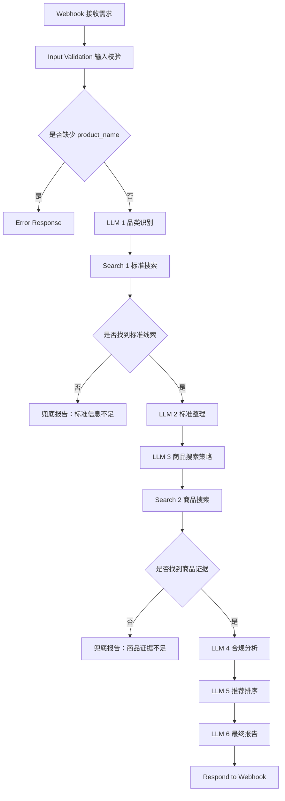

# Product Standard Compliance Recommendation Agent

产品标准合规推荐助手是一个面向商品选购、采购辅助、产品合规初筛的 AI Workflow 项目。它不是简单推荐商品，而是先查询产品相关生产执行标准，再根据公开证据筛选商品，最后生成结构化推荐报告。

> 一句话介绍：把“我想买一个安全合规的产品”转化为“品类识别、标准检索、证据判断、推荐排序、风险提示”的可运行 n8n 工作流。

## Project Status

当前版本为 AI Workflow Demo，可导入 n8n 运行。

默认使用 OpenAI Chat Completions API 和 SerpAPI / Bing Search / Tavily / Firecrawl 等搜索能力。如果没有配置搜索 API，可以使用 [examples/mock_search_results.json](examples/mock_search_results.json) 进行模拟演示。

## 能力标签

`AI Product Manager` `n8n Workflow` `LLM Agent` `Product Compliance` `Evidence-based Recommendation` `Prompt Engineering` `Risk Control` `Recommendation System`

## 项目背景

很多商品页面会强调“安全”“食品级”“母婴可用”，但普通用户很难判断这些描述是否有公开标准、检测报告或官方说明支撑。尤其在儿童用品、食品接触材料、家电、个护和采购场景中，单纯按销量、价格或营销文案推荐商品，容易忽略合规风险。

本项目的核心思路是先建立标准约束，再做商品筛选：先查清产品可能涉及的国家标准、行业标准、认证要求，再分析商品页面是否公开标注相关执行标准、认证或检测信息，最后用评分规则给出推荐结论。

## 用户痛点

| 痛点 | 具体表现 | 项目解决方式 |
|---|---|---|
| 不知道该看什么标准 | 用户只知道产品名，不知道对应国家标准或行业标准 | LLM 先识别品类，再生成标准检索关键词 |
| 商品页面信息不透明 | 电商页面常见营销词，但缺少标准编号或检测报告 | 搜索品牌官网、官方旗舰店和检测报告页面 |
| 推荐缺少依据 | 普通导购只说明“值得买”，不说明证据来源 | 输出证据等级、来源链接和不确定性说明 |
| 大模型容易幻觉 | LLM 可能补全不存在的标准编号或链接 | Prompt 强制禁止编造，缺证据时必须标注风险 |
| 采购初筛效率低 | 人工查标准、看商品页面耗时 | n8n 自动编排检索、分析和报告生成 |

## 解决方案

工作流把任务拆成六个 AI 判断步骤和两个搜索步骤：

1. 结构化用户需求。
2. 识别产品品类和合规关注点。
3. 检索相关标准、认证和监管信息。
4. 整理标准编号、适用范围和关键要求。
5. 检索商品、品牌官网、官方旗舰店和检测报告。
6. 判断商品证据等级和风险。
7. 按 100 分制排序。
8. 输出 Markdown 推荐报告。

## 核心工作流



## 产品功能

| 功能 | 说明 |
|---|---|
| 用户需求接收 | 通过 Webhook 接收产品、预算、地区和特殊要求 |
| 品类识别 | 判断产品类别、使用场景和合规风险 |
| 标准检索 | 搜索国家标准、行业标准、认证和检测要求 |
| 标准整理 | 提取标准编号、名称、适用范围、关键要求和来源 |
| 商品搜索 | 根据标准关键词搜索商品、品牌官网和电商详情页 |
| 证据判断 | 判断商品是否公开标注执行标准或认证信息 |
| 推荐排序 | 使用 100 分制进行推荐等级划分 |
| 报告生成 | 输出结构化 Markdown 报告 |

## 输入字段

| 字段 | 类型 | 必填 | 说明 |
|---|---|---|---|
| product_name | string | 是 | 产品名称，例如“儿童保温杯” |
| use_case | string | 否 | 使用场景，例如“小学生日常上学使用” |
| budget | string | 否 | 预算，例如“100 元以内” |
| region | string | 否 | 购买地区，例如“中国大陆” |
| extra_requirements | string | 否 | 特殊要求，例如“安全、防漏、材质合规” |

## 输出报告结构

| 模块 | 内容 |
|---|---|
| 产品类别判断 | 说明产品所属品类、适用场景和合规关注点 |
| 相关标准整理 | 标准名称、编号、类型、适用范围、证据等级和来源 |
| 选品判断标准 | 必须满足、优先满足和需要避坑的风险点 |
| 推荐产品列表 | 产品名称、品牌、价格、证据等级、评分、理由和链接 |
| 最终推荐结论 | 最推荐、性价比最高、预算友好和不建议购买类型 |
| 不确定性说明 | 明确哪些信息仍需用户二次确认 |
| 免责声明 | 说明报告不是检测结论或法律意见 |

## n8n 节点说明

| 节点 | 类型 | 作用 |
|---|---|---|
| Webhook | Webhook | 接收外部请求 |
| Input Validation | Code | 标准化输入并检查 product_name |
| IF - Missing product_name | IF | 缺少产品名称时进入错误响应 |
| Error Response | Respond to Webhook | 返回输入错误 |
| LLM 1 | HTTP Request | 产品品类识别 |
| Search 1 | HTTP Request | 标准搜索 |
| IF - Standard Search Empty | IF | 标准搜索无结果时兜底返回 |
| LLM 2 | HTTP Request | 标准整理 |
| LLM 3 | HTTP Request | 商品搜索策略 |
| Search 2 | HTTP Request | 商品搜索 |
| IF - Product Search Empty | IF | 商品证据不足时兜底返回 |
| LLM 4 | HTTP Request | 产品合规分析 |
| LLM 5 | HTTP Request | 推荐排序 |
| LLM 6 | HTTP Request | 最终报告生成 |
| Respond to Webhook | Respond to Webhook | 返回最终 Markdown 报告 |

## Prompt 设计亮点

| 设计点 | 说明 |
|---|---|
| 节点分工 | 每个 LLM 只处理一个明确任务，减少上下文混乱 |
| 证据约束 | 所有标准、链接、价格、检测报告必须来自输入或搜索结果 |
| 反幻觉规则 | 没有证据时必须输出“暂无公开证据证明” |
| 事实/推断分离 | 要求模型区分事实、推断和不确定性 |
| 兜底策略 | 搜索不足时不强行推荐，而是输出风险说明 |

## 证据等级模型

项目使用 A-E 证据等级判断商品合规证据可信度。

| 证据等级 | 来源类型 | 可信度 | 使用方式 |
|---|---|---:|---|
| A | 政府、国家标准平台、监管机构 | 最高 | 确认标准存在、状态和适用范围 |
| B | 品牌官网、官方检测报告、官方旗舰店 | 高 | 判断商品是否公开标注标准 |
| C | 电商详情页 | 中 | 作为商品标注线索，需要二次确认 |
| D | 第三方文章、论坛、问答 | 低 | 只能作为补充线索 |
| E | 无公开证据 | 不可信 | 不允许强推荐 |

完整说明见 [docs/evidence_model.md](docs/evidence_model.md)。

## 评分规则

使用 100 分制：

| 评分项 | 权重 |
|---|---:|
| 标准匹配度 | 40 分 |
| 证据可信度 | 25 分 |
| 用户需求匹配度 | 15 分 |
| 价格合理性 | 10 分 |
| 品牌/渠道可信度 | 10 分 |

推荐等级见 [docs/scoring_rules.md](docs/scoring_rules.md)。

## 风险控制策略

- 不编造标准编号。
- 不编造商品链接。
- 不编造检测报告。
- 不把“可能符合”写成“确定符合”。
- 搜索不到证据时不输出强推荐。
- 电商宣传词不能等同于合规证明。
- 输出必须包含证据等级、证据摘要和不确定性。

## 示例输入

```json
{
  "product_name": "儿童保温杯",
  "use_case": "小学生日常上学使用",
  "budget": "100元以内",
  "region": "中国大陆",
  "extra_requirements": "安全、防漏、材质合规、有执行标准说明"
}
```

## 示例输出

查看 mock 示例报告：

[examples/sample_output.md](examples/sample_output.md)

说明：示例报告使用虚构商品和 `example.com` 链接，仅用于展示工作流输出结构，不代表真实购买建议。

## 如何导入 n8n

1. 打开 n8n。
2. 新建 workflow。
3. 选择右上角菜单中的 `Import from File`。
4. 选择 [n8n/product_standard_compliance_workflow.json](n8n/product_standard_compliance_workflow.json)。
5. 检查 Webhook、OpenAI HTTP Request 和搜索 API 节点。
6. 配置 API Key。
7. 点击 `Execute workflow` 进行测试。

更详细步骤见 [n8n/import_guide.md](n8n/import_guide.md)。

## 如何配置 API Key

复制 `.env.example` 为 `.env`，然后填入自己的 Key：

```bash
OPENAI_API_KEY=your_openai_api_key
SERPAPI_API_KEY=your_serpapi_api_key
N8N_WEBHOOK_URL=http://localhost:5678/webhook/product-compliance-recommend
```

注意：

- 不要把真实 API Key 上传到 GitHub。
- `.env` 已被 `.gitignore` 忽略。
- `.env.example` 只保留示例字段，不包含真实密钥。

## 如何测试 Webhook

```bash
curl -X POST "http://localhost:5678/webhook/product-compliance-recommend" \
  -H "Content-Type: application/json" \
  -d @n8n/test_payload.json
```

如果使用 n8n 测试模式，请把 URL 改为 `webhook-test` 地址。

## 截图展示区

当前仓库不放置假截图。真实运行后建议补充：

| 截图 | 作用 |
|---|---|
| `assets/workflow_screenshot.png` | 展示 n8n 工作流已经搭建 |
| `assets/webhook_test.png` | 展示 Webhook 可调用 |
| `assets/search_result_debug.png` | 展示搜索节点返回真实数据 |
| `assets/final_report.png` | 展示最终报告可读 |
| `assets/github_readme_preview.png` | 展示 GitHub 首页效果 |

## 项目亮点

- 不是普通导购，而是证据驱动的合规推荐。
- 工作流包含输入校验、异常处理和兜底返回。
- Prompt 重点控制幻觉，强制保留不确定性。
- 评分规则可解释，适合作品集展示。
- 支持真实搜索 API，也支持 mock demo。

## 当前局限

- 搜索结果质量依赖外部 API。
- 电商详情图中的执行标准可能需要 OCR 才能识别。
- 标准适用性仍需要人工结合产品材质和使用场景确认。
- 当前版本用于合规初筛，不替代检测机构、监管结论或法律意见。

## 未来优化方向

- 接入标准平台定向检索。
- 增加网页正文抓取和详情图 OCR。
- 建立品类标准知识库。
- 增加人工审核节点。
- 输出 PDF 或 Notion 报告。
- 增加证据截图留存和时间戳。

## 面试讲解方式

可以这样介绍：

“这是一个面向商品选购和采购初筛的 AI Workflow 项目。我没有让大模型直接推荐商品，而是先识别产品品类，再检索相关标准和认证要求，然后搜索商品页面是否公开标注执行标准、检测报告或官方说明。最后系统按标准匹配度、证据可信度、需求匹配度、价格和渠道可信度进行评分。这个项目重点展示了我对 AI Agent 流程拆解、Prompt 风控、证据链设计和产品化交付的理解。”

## 适合展示的产品经理能力

| 能力 | 体现方式 |
|---|---|
| 需求拆解 | 将“买安全产品”拆成标准检索、证据判断、推荐排序 |
| 流程设计 | 使用 n8n 串联 LLM、搜索 API 和报告生成 |
| 风险控制 | 通过 Prompt 和兜底逻辑降低幻觉风险 |
| 数据判断 | 使用证据等级和评分规则解释推荐 |
| 作品集表达 | 提供 README、PRD、复盘、示例报告和截图清单 |