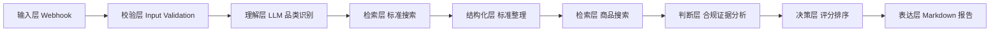

# System Architecture

## 架构目标

本项目的架构目标是把一个高幻觉风险的商品推荐任务，拆解为可验证、可追踪、可兜底的 AI Workflow。

## 架构分层

## 模块说明

| 模块 | 作用 | 风控点 |
|---|---|---|
| 输入层 | 接收用户需求 | 缺少 product_name 时停止 |
| 理解层 | 识别品类和检索关键词 | 不输出标准结论 |
| 检索层 | 搜索标准和商品证据 | 保留来源链接 |
| 结构化层 | 整理标准字段 | 不编造标准编号 |
| 判断层 | 分析证据等级 | 区分事实、推断和不确定性 |
| 决策层 | 按规则评分 | 证据不足时降级 |
| 表达层 | 输出报告 | 保留免责声明 |

## 数据边界

| 数据 | 来源 | 是否可作为结论 |
|---|---|---|
| 标准编号 | 搜索结果或标准平台 | 可以作为标准线索 |
| 商品链接 | 搜索 API | 可以作为商品线索 |
| 检测报告 | 品牌官网或官方页面 | 可以作为强证据 |
| 电商宣传语 | 电商详情页 | 只能作为弱证据 |
| 模型常识 | LLM 生成 | 不能作为事实结论 |

## 关键架构原则

1. 先查标准，再推荐商品。
2. 搜索结果不足时进入兜底流程。
3. 标准和商品证据分开判断。
4. 所有推荐必须有证据等级。
5. 报告必须保留不确定性。