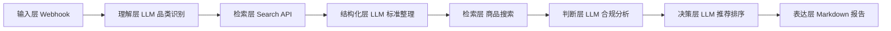

# 系统架构

## 架构分层

## 关键设计

- 输入层：使用结构化字段减少歧义。
- 检索层：外接搜索 API，避免模型凭空生成事实。
- 判断层：强制区分公开证据、弱证据和无证据。
- 决策层：使用可解释评分，而不是黑箱推荐。
- 输出层：面向普通用户表达，保留专业依据。

## 数据边界

工作流不保存用户隐私数据，不内置真实商品库，不把模型推断当作官方结论。所有标准、商品和链接都应来自搜索 API 或用户提供的数据。

