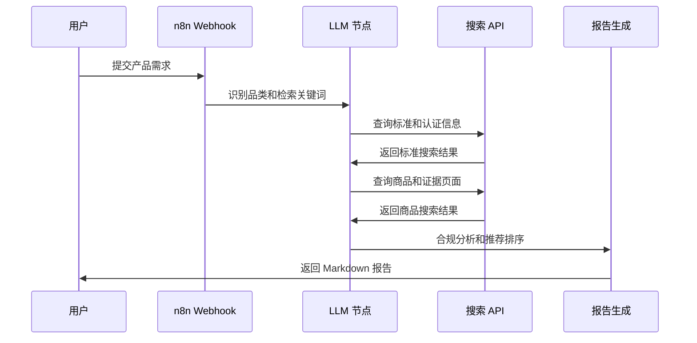

# 用户流程

```mermaid
sequenceDiagram
    participant User as 用户
    participant Webhook as n8n Webhook
    participant LLM as LLM 节点
    participant Search as 搜索 API
    participant Report as 报告生成

    User->>Webhook: 提交产品需求
    Webhook->>LLM: 识别品类和检索关键词
    LLM->>Search: 查询标准和认证信息
    Search->>LLM: 返回标准搜索结果
    LLM->>Search: 查询商品和证据页面
    Search->>LLM: 返回商品搜索结果
    LLM->>Report: 合规分析和推荐排序
    Report->>User: 返回 Markdown 报告
```

## 用户操作

1. 输入产品名称、使用场景、预算、购买地区和特殊要求。
2. 等待工作流检索标准和商品证据。
3. 阅读最终报告中的标准表格、推荐产品和风险提醒。
4. 购买前再次核对商品详情页、包装标识或品牌客服信息。

