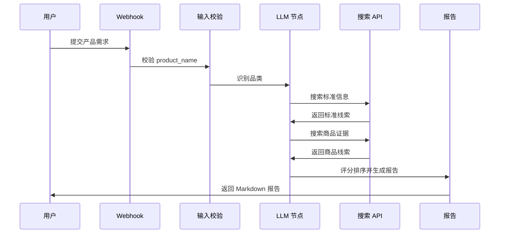

# User Flow

## 用户流程图

## 用户操作步骤

| 步骤 | 用户动作 | 系统反馈 |
|---:|---|---|
| 1 | 输入产品需求 | 接收结构化字段 |
| 2 | 等待执行 | 工作流搜索标准和商品证据 |
| 3 | 查看报告 | 获得标准、推荐和风险提醒 |
| 4 | 二次确认 | 根据来源链接检查商品详情 |

## 异常体验

| 场景 | 用户看到的结果 |
|---|---|
| 缺少产品名称 | 返回错误 JSON |
| 标准线索不足 | 返回兜底报告，不强行推荐 |
| 商品证据不足 | 返回风险说明，不输出强推荐 |